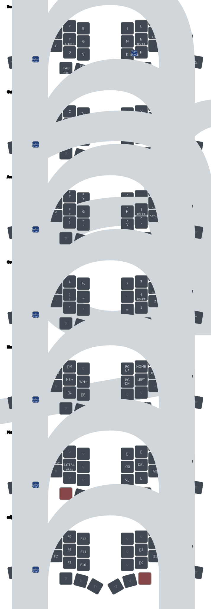

# Totem ZMK Configuration

Custom ZMK firmware configuration for the [GEIGEIGEIST Totem](https://github.com/GEIGEIGEIST/totem) split keyboard with **Dual battery monitoring** and optional **Prospector status display dongle**.

## Features

- **Colemak-DH Matrix layout** optimized for ortholinear keyboards
- **Dual battery monitoring** - Reports battery levels for both keyboard halves
- **5 layers** optimized for Python and JavaScript development
- **Homerow mods** for comfortable modifier access
- **Mouse support** with scroll and movement controls
- **Combos** for quick access to ESC, dictation, and special characters
- **Prospector Dongle Display** (optional) - Real-time operator status screen showing layer, modifiers, WPM, output status, and battery levels

## Layers

### BASE - Colemak-DH

Main typing layer with homerow mods (GUI/Alt/Shift/Ctrl).

### CODE

Optimized symbol layer for Python/JavaScript:

- Brackets `[]` `()` on homerow for easy access
- Numbers arranged as numpad on right side
- Frequently-used symbols (`_`, `@`, `#`, `"`, `'`) in comfortable positions

### NAV

Navigation and mouse control layer with arrow keys, page navigation, and mouse movements.

### MOD

System controls including media keys, screen lock macros, and brightness/volume controls.

### ADJ

Function keys and Bluetooth device switching.

## Keymap Visualization



## Installation

### Standalone Mode (No Dongle)

1. Fork this repository
2. Enable GitHub Actions in your fork
3. Modify `config/totem.keymap` as needed
4. Push changes to trigger automatic firmware build
5. Download firmware from Actions artifacts
6. Flash `totem_left-xiao_ble-zmk.uf2` to left half
7. Flash `totem_right-xiao_ble-zmk.uf2` to right half

### Dongle Mode (Recommended)

The Totem can be used with a Prospector-style BLE dongle featuring a status display. This improves battery life on both keyboard halves and provides real-time visibility of layer, modifiers, WPM, output status, and battery levels.

**Hardware:** Seeed Studio XIAO nRF52840 + Waveshare 1.69" LCD (ST7789V, 240x280)

**Build Artifacts:**
- `totem_dongle-xiao_ble-zmk.uf2` - Dongle firmware with Prospector operator screen
- `totem_left-xiao_ble-zmk.uf2` - Left half (peripheral mode)
- `totem_right-xiao_ble-zmk.uf2` - Right half (peripheral mode)
- `settings_reset_dongle-xiao_ble-zmk.uf2` - Clear dongle BLE bonds
- `settings_reset_keyboard-xiao_ble-zmk.uf2` - Clear keyboard half BLE bonds

**Flashing Procedure:**

1. **Clear existing bonds:** Flash `settings_reset_dongle` to the dongle and `settings_reset_keyboard` to both keyboard halves
2. **Flash dongle:** Flash `totem_dongle-xiao_ble-zmk.uf2` to the dongle
3. **Flash peripherals:** Flash `totem_left` and `totem_right` UF2 files to their respective halves
4. **Power cycle:** Disconnect and reconnect all devices

**Pairing Sequence:**

1. Power on the dongle (plug into USB)
2. Power on the **left half first** - wait for the left battery indicator to appear on the dongle display
3. Power on the **right half** - the right battery indicator should appear next

> **Important:** The pairing order determines battery widget ordering. Left half must pair first for correct display.

**Prospector Display Features:**

- **Operator Layout:** Information-dense display with layer wheel, modifier indicators, WPM, BLE output status, and battery bars for up to 3 peripherals
- **Four Layout Options:** Switch between Classic, Radii, Field, and Operator layouts via `.conf` config
- **Fixed Brightness:** Set via `CONFIG_PROSPECTOR_FIXED_BRIGHTNESS` (manual brightness via `&inc_bri`/`&dec_bri` behaviors coming in a future update via [PR #23](https://github.com/carrefinho/prospector-zmk-module/pull/23))

**Rollback to Standalone Mode:**

To revert to non-dongle operation:
1. Edit `build.yaml` and remove the `cmake-args` lines from `totem_left` and `totem_right` targets
2. Remove the `totem_dongle prospector_adapter` and `settings_reset_dongle` build targets
3. Flash `settings_reset_keyboard` to all devices
4. Build and flash the reverted firmware to both halves

## Hardware

- **Keyboard:** GEIGEIGEIST Totem (38-key split)
- **Controller:** Seeeduino XIAO BLE (nRF52840)
- **Firmware:** ZMK

### Optional Dongle Hardware

- **Board:** Seeed Studio XIAO nRF52840
- **Display:** Waveshare 1.69" LCD (240x280, ST7789V controller, SPI interface)
- **Firmware:** ZMK with Prospector ZMK module
- **Display Features:** PWM backlight control, fixed brightness config, four status screen layouts (Operator selected)

### Optional Features

- **ZMK Studio** - Currently disabled (commented out in `config/totem.conf` and `build.yaml`). To enable: uncomment the studio lines, replace `&none` with `&studio_unlock` in the ADJ layer, and add the snippet + cmake-args to `build.yaml`.

## Special Features

### Combos

- **Q + W:** ESC
- **N + M:** Dictation (Alt+Space)
- **U + Y:** ñ character

### Macros

- **Mac Lock:** Cmd+Ctrl+Q
- **Win Lock:** Win+L

### Battery Monitoring

Configured for split battery level reporting to support peripheral battery monitoring apps.

## Changing the Keyboard Name

To change the Bluetooth device name:

1. Edit `config/totem.conf` and set:

   ```
   CONFIG_ZMK_KEYBOARD_NAME="Your Custom Name"
   ```

2. Build the firmware (GitHub Actions will create 5 files including settings_reset for both dongle and keyboard)

3. Flash the firmware:
   - Flash `settings_reset_dongle-xiao_ble-zmk.uf2` to the dongle
   - Flash `settings_reset_keyboard-xiao_ble-zmk.uf2` to both halves
   - Flash `totem_dongle-xiao_ble-zmk.uf2` to the dongle
   - Flash `totem_left-xiao_ble-zmk.uf2` to left half
   - Flash `totem_right-xiao_ble-zmk.uf2` to right half

4. Clear Bluetooth bonds on the keyboard using `BT_CLR_ALL`

Note: The settings reset is required because the keyboard name is stored in persistent memory.

## Resources

### zmk-config

[Keymap Editor](https://nickcoutsos.github.io/keymap-editor/)

[Official ZMK site](https://zmk.dev/)

[Keyboard Tester](https://en.key-test.ru/)
